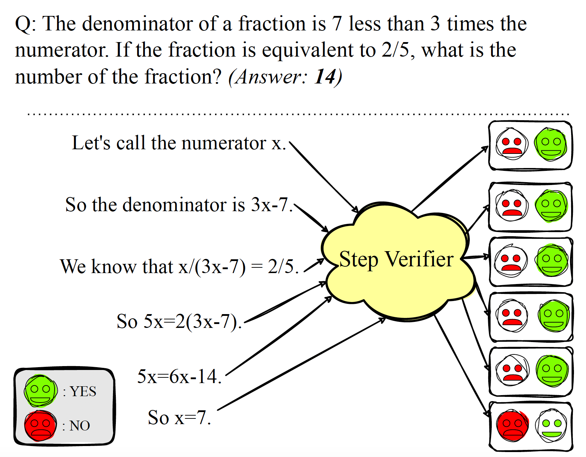

# Generative Process Reward Model

## Here is the code for Generatove Process Reward model, GenPRM, using GSM8K and prm800k datasets 

  

The code for training the reward model with the GSM8K dataset is located in the "gsm8k_rm" folder, and for training with the PRM800K dataset using LoRA, it is in the "prm800k_with_lora" folder.

